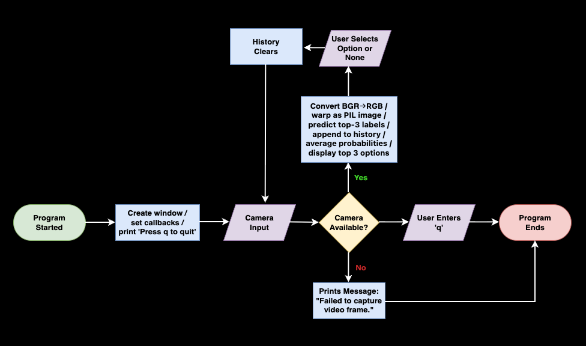

# Computer Vision for Self-Checkout Item Prediction and Fraud Detection
## ISYS 57103 - Sarah Lawlis and Abdussaboor Muhammad
---
### Abstract

As retailers adopt self-checkout systems to streamline operations, a new challenge emerges: detecting and preventing fraud when produce and other untagged items are weighed and entered manually. Customers may intentionally or unintentionally mislabel items, leading to revenue loss and inventory inaccuracies. Inspired by Walmart’s use of AI (pictured in Figure 1) to suggest likely produce matches, this project will explore how computer vision models can identify produce at checkout and cross-verify it with customer selections. By creating a labeled item dataset and training a vision model to recognize common fruits and vegetables, we aim to replicate and extend existing self-checkout fraud detection systems. This project will evaluate the accuracy of classification across similar-looking items (e.g., russet vs. sweet potatoes) and consider tradeoffs between real-time performance and reliability. Ultimately, our work will demystify how AI-powered computer vision is being deployed in everyday retail environments and highlight both its promise and limitations in reducing fraud while maintaining customer convenience.

<figure style="text-align: left;">
  
  <figcaption><em>Figure 1: Self-Checkout Item Detection Powered by AI at Walmart</em></figcaption>
</figure>

### Problem

Self-checkout systems introduce several challenges, including but not limited to the following:
  1. Fraud
    - Customers can intentionally scan the incorrect item to pay less for the actual item they are purchasing. This is one of the largest sources of decrement in the retail industry and one of the greatest drawbacks of self-checkout
  2. Mislabeling
    - Employees and customers may accidentally mislabel produce that look very similar, such as varieties of apples, oranges, potatoes, etc.
  3. Inefficiency
    - Employees and customers may take extra time to make sure they are correctly scanning an item or fixing a mistake, which can lead to inefficiency in checkout lines, leading to a loss of potential sales
  4. Accessibility Issues
    - Customers with vision or physical impairments may have difficulty interacting with and using self-checkout systems

### Objectives

* Use a fine-tuned Hugging Face vision model on a curated produce dataset to reliably distinguish look-alike items (e.g., apples vs. peaches) during self-checkout
* Deliver a working inference pipeline that runs locally and via webcam, with configurable model paths and camera inputs for lab demos
* Ship runnable, isolated artifacts (Make targets, Docker image, and cached model workflow) that mirror real DevOps delivery patterns for edge deployments
* Keep the codebase structured and tested (pytest) to reflect production practices: clear entry points under `scripts/`, reusable modules under `src/`, and repeatable setup via requirements and env management

### Methods

* Baseline feature extractor: ResNet-50 used as an off-the-shelf backbone to gauge classification performance on produce images and set a reference for inference speed/accuracy
* Fine-tuned model: Hugging Face `jazzmacedo/fruits-and-vegetables-detector-36`, fine-tuned on a curated fruit/vegetable dataset; loaded via `scripts/cache_model.py` for offline use and exercised through `scripts/run_webcam.py` and tests in `produce_image_detection_test.py`
* Prediction smoothing: The webcam pipeline (`src/webcam_pipeline.py`) keeps a rolling window of top-3 predictions and averages their probabilities to pick the most likely item, reducing frame-to-frame noise before prompting the user
* CI/CD: GitHub Actions pipeline (`.github/workflows/ci.yml`) installs deps, runs pytest, and enforces repeatable builds; Make targets mirror the pipeline steps locally and Docker image builds for deployment or edge demos
* End-to-end structure: Figure 2 shows the flow from camera input through preprocessing, model inference, and probability aggregation to the user-facing selection UI, reflecting the same modular layout in `src/` and `scripts/`

*Figure 2: Program Diagram*

### Future Work

* Frequency-domain filtering: Experiment with FFT-based preprocessing to suppress background texture and lighting flicker before inference, potentially boosting class separation for visually similar produce in noisy store environments
* Robust localization: Introduce a YOLO-based detector to first isolate produce regions in the frame (cropping out hands, faces, and packaging) before classification, reducing false positives and stabilizing the downstream probability averaging flow shown in Figure 2

### Contributions

Contributions from both teammates were equal based on skill level:
  * Sarah: Created repository and POC, handled version control
  * Abdussaboor: Worked on documentation and writing the paper, contributed to code during several work sessions together

### References

* jazzmacedo. (2023). fruits-and-vegetables-detector-36 [ML model]. Hugging Face. https://huggingface.co/jazzmacedo/fruits-and-vegetables-detector-36
* Lenyk, Z., & Park, J. (2021, February 3). Microsoft Vision Model ResNet-50 combines web-scale data and multi-task learning to achieve state-of-the-art. Microsoft Research Blog. https://www.microsoft.com/en-us/research/blog/microsoft-vision-model-resnet-50-combines-web-scale-data-and-multi-task-learning-to-achieve-state-of-the-art/
